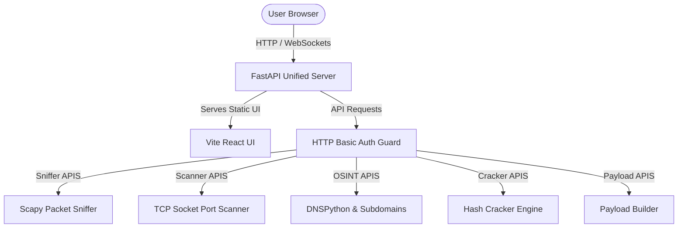

# 🛡️ Aegis Sentinel — Advanced Cybersecurity & Network Security Suite

[](https://488e475d50b2e2.lhr.life)
> **Live URL**: [https://488e475d50b2e2.lhr.life](https://488e475d50b2e2.lhr.life)

Aegis Sentinel is a unified, single-container cybersecurity application designed to provide network analysis, scanning, intelligence gathering, utility generations, and threat detection. Built with a high-performance **FastAPI backend** and a modern, responsive **Vite React frontend**, the application runs as a unified production service serving static assets directly from the backend to eliminate CORS issues and dual-port configurations.

---

## 🚀 Key Features

*   **🛡️ Intrusion Detection System (IDS) Console**: Live simulated threat logs and attack alerts monitor console with attack simulator capabilities.
*   **🔌 Packet Sniffer**: Capture and inspect live packet traffic (TCP, UDP, ICMP, DNS, HTTP, TLS) with real-time hex dumps and ASCII decoding. Falls back to simulated traffic on sandbox/serverless environments.
*   **🔍 Port Scanner**: Automated TCP port scanning across configurable port ranges to find open ports and running services.
*   **🌐 OSINT Suite**: DNS records query tools (A, AAAA, MX, TXT, CNAME) and automated subdomain lookup mapping.
*   **📍 GeoIP & WHOIS Lookup**: Locate physical details, ISP info, and ASN mappings for any remote IP or domain name.
*   **🔑 Hash Cracker & Analyzer**: Evaluate password strengths against entropy checkups and crack MD5, SHA-1, and SHA-256 hashes using built-in wordlist depths.
*   **💻 Shell Payload Generator**: Construct customized reverse shell payloads with selectable shell interpreters (Bash, Sh, PowerShell, Python, Netcat) and encoding schemas.

---

## ⚙️ Architecture & Tech Stack



-   **Frontend**: React (v19), Vite (v8), Lucide Icons, and Vanilla CSS (Glassmorphism & Sleek Dark Mode design).
-   **Backend**: FastAPI, Uvicorn, Python (v3.11/v3.13), Scapy (for packet sniffing), and aiofiles (for serving static assets).
-   **Network Requirements**: Standard packet sniffing requires administrator/root privileges (raw socket access).

---

## 🛠️ Installation & Setup

### Option 1: Manual Run (Recommended for Local Dev & Testing)

1.  **Build Frontend**:
    Ensure [NodeJS](https://nodejs.org) is installed, navigate to the `frontend` directory, install dependencies, and compile the static assets:
    ```bash
    cd frontend
    npm install
    npm run build
    ```
    This compiles the React bundle into `frontend/dist`.

2.  **Start FastAPI Backend**:
    Navigate to the `backend` directory, activate the Python virtual environment, install requirements, and start the Uvicorn production server:
    ```bash
    cd ../backend
    .venv/Scripts/activate     # For Windows (or source .venv/bin/activate on Linux/Mac)
    pip install -r requirements.txt
    python -m uvicorn app.main:app --host 0.0.0.0 --port 8000
    ```
    The FastAPI backend will automatically detect `frontend/dist` and serve it on [http://localhost:8000](http://localhost:8000).

---

### Option 2: Docker Compose (VPS / Self-Hosting)

A [docker-compose.yml](docker-compose.yml) and [Dockerfile](Dockerfile) are configured at the project root for unified building.

1.  **Configure Environment Variables**:
    Create a `.env` file at the root:
    ```env
    AEGIS_USERNAME=your_secure_username
    AEGIS_PASSWORD=your_secure_password
    ```

2.  **Run Service**:
    Start the container:
    ```bash
    docker compose up -d --build
    ```
    *Note: The Docker configuration includes `cap_add: [NET_ADMIN, NET_RAW]` to enable live network packet sniffing inside the container.*

---

## 🔐 Credentials & Configuration

Aegis Sentinel endpoints are protected by HTTP Basic Authentication. You can configure credentials via environment variables:

| Environment Variable | Description | Default Value |
|----------------------|-------------|---------------|
| `AEGIS_USERNAME`     | Login username for dashboard | `admin` |
| `AEGIS_PASSWORD`     | Secure password for dashboard | `aegis2024` |
| `PORT`               | Server listener port | `8000` |

---

## 🌐 Live Deployments

Aegis Sentinel can be deployed to container hosting platforms (such as Render, Fly.io, or Railway) or served via reverse SSH tunnels:
-   **Cloud Hosting**: Connect your repository to the platform. The unified `Dockerfile` will compile and run the application. *Note: Sniffer capabilities will automatically fall back to "Simulation Mode" if the environment restricts raw socket bindings.*
-   **Tunneling (Temporary Live URL)**: Run the manual local server on port `8000`, then route public requests using an SSH tunnel:
    ```bash
    ssh -o StrictHostKeyChecking=no -R 80:127.0.0.1:8000 nokey@localhost.run
    ```

---

## 📝 License

Distributed under the MIT License. See `LICENSE` for more information.
